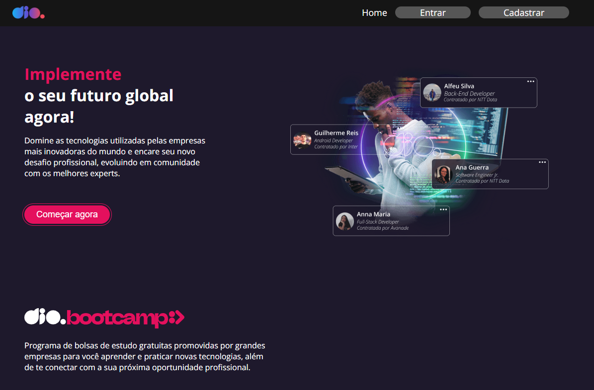
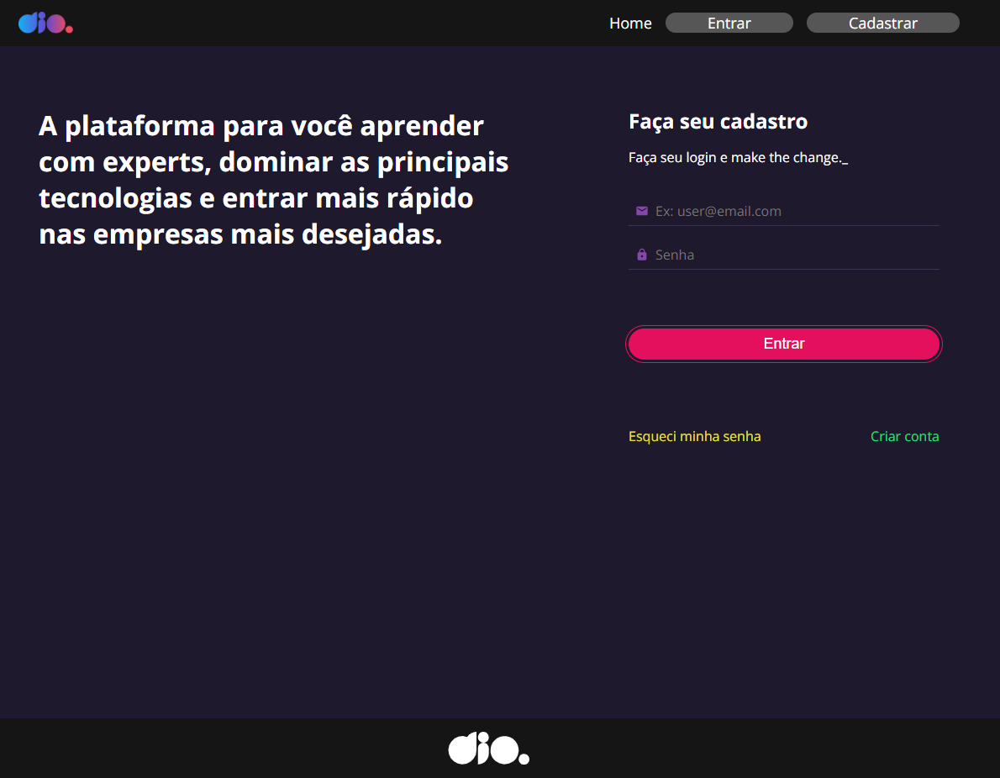
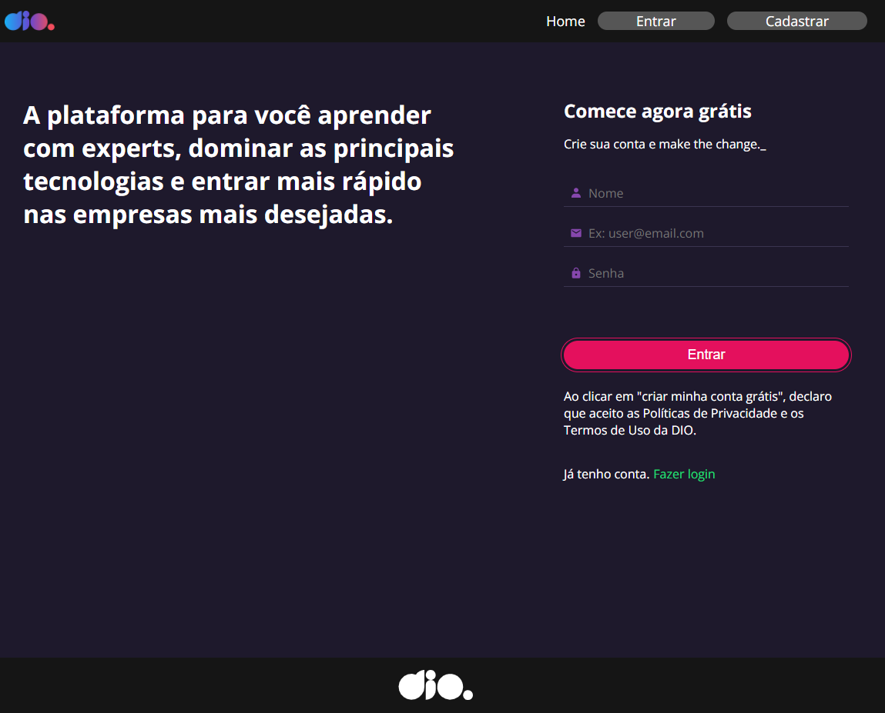
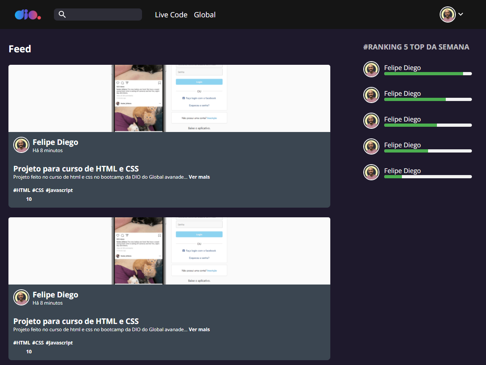

# Módulo 3 - Ampliando o conhecimento em React

Este é o projeto desenvolvido durante o Módulo 3 do curso de formação em React da DIO.me. O objetivo deste módulo é aprofundar o conhecimento em React e aplicar conceitos importantes para o desenvolvimento de aplicações front-end mais complexas.

## Descrição do Projeto

O projeto consiste na criação de um clone da página home, login, cadastro e feed do site da DIO.me. Durante o desenvolvimento, foram aplicados diversos conceitos essenciais para o desenvolvimento de aplicações React, incluindo:

- Estados do React: Gerenciamento de estados e atualização dos componentes com base em mudanças nos dados.
- Hook Form: Utilização do React Hook Form para gerenciar formulários e validação dos campos.
- Requisições com Axios: Realização de requisições HTTP para uma API simulada utilizando o Axios.
- Server-json: Configuração de um servidor JSON para simular uma API de back-end.
- Styled-Components: Estilização dos componentes usando Styled-Components para uma melhor organização e reutilização de estilos.

## Pré-Visualização do Projeto

|  |  |
| --- | --- |
|  |  |

Para adicionar a seção de instalação do projeto no README.md com os passos mencionados, você pode seguir este formato:

```markdown
# Nome do Projeto

## Instalação

Siga os passos abaixo para configurar e executar o projeto localmente:

1. Clone o repositório:

```bash
git clone https://github.com/seu-usuario/seu-projeto.git
```

2. Instale as dependências:

```bash
cd seu-projeto
npm install
```

3. Inicie o projeto em localhost:3000:

```bash
npm start
```

4. Inicie a API fake em localhost:8001:

```bash
npm run api
```

Agora, você pode acessar o projeto em `http://localhost:3000` no seu navegador.


Lembre-se de substituir "seu-usuario" e "seu-projeto" com os valores corretos, de acordo com o link do seu repositório no GitHub.

## Considerações Finais

O Módulo 3 do curso de formação em React da DIO.me proporcionou a oportunidade de aplicar conceitos avançados e aprofundar o conhecimento na criação de aplicações React mais robustas. O projeto do clone da página da DIO.me abrangeu conceitos essenciais e ofereceu uma visão mais prática do desenvolvimento front-end com React.
